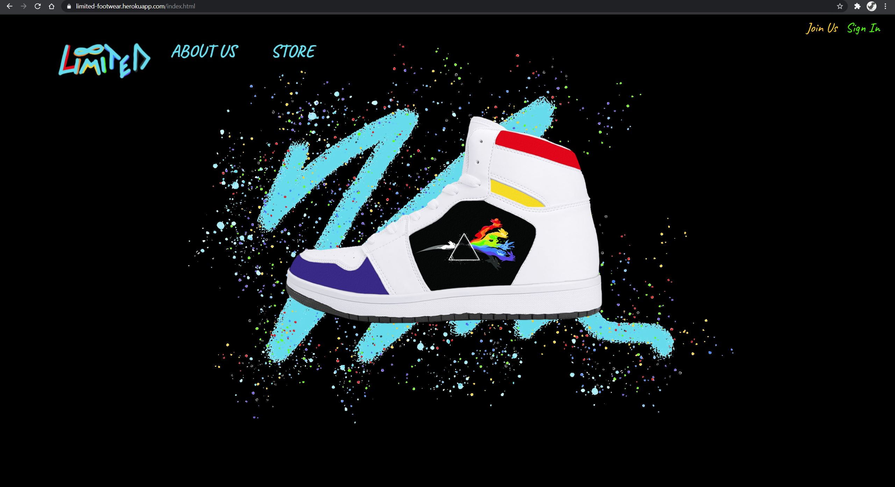
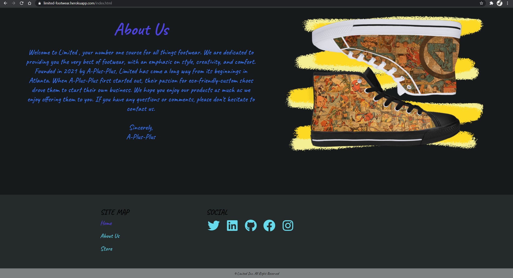
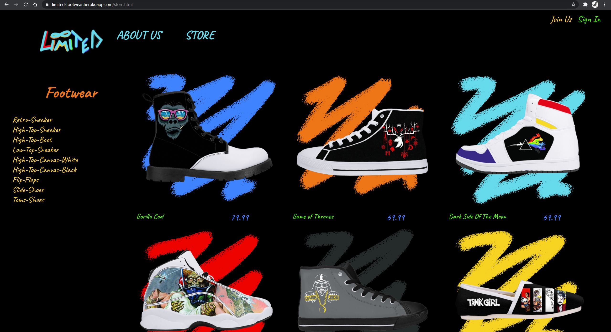
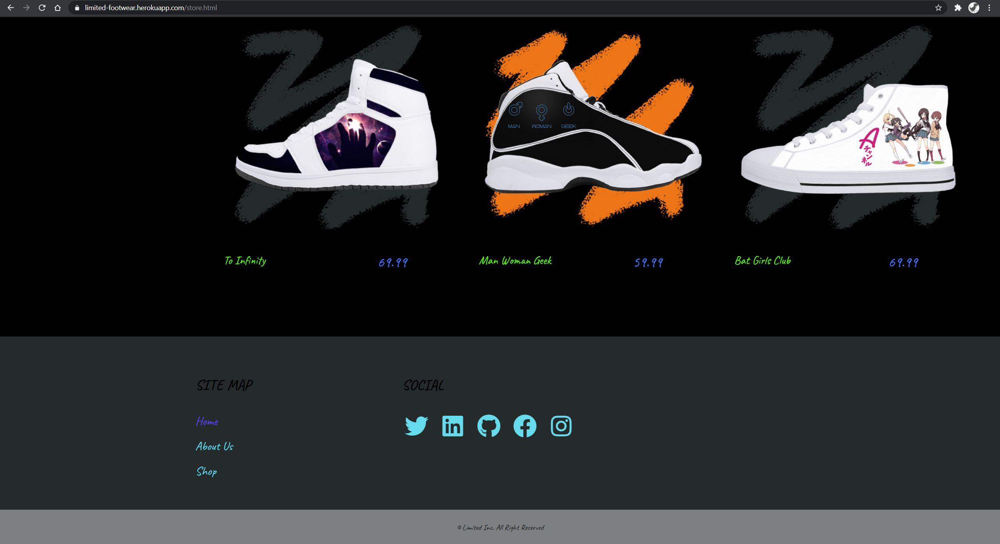
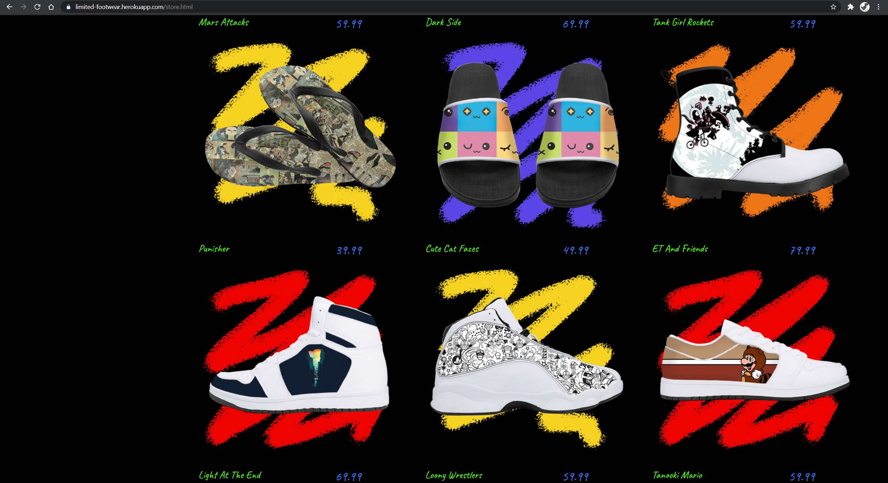
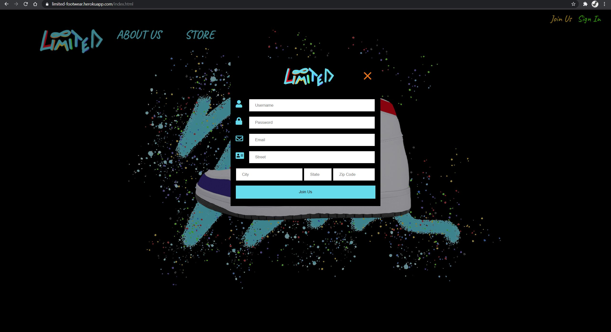

# Project-2: Limited

## Description

The main objective in this project was to build an application with a Node and Express Web Server, be backed by a MySQL database with a Sequelize ORM, utilize at least one new package, and be deployed using Heroku with a seeded database.

This project, Limited, is an e-commerce site that offers custom-made shoes to its customers. Customers can view all footwear products or sort by them type, if so they choose. Moreover, customers have the ability to create their own accounts for a more user-friendly experience. 

## link to deployed application

[repository](https://github.com/Limnation/limited)

[app heroku](https://limited-footwear.herokuapp.com/)

## Visuals

## Installation

List of Dependencies:

- bcrypt - The bcrypt library on NPM makes it really easy to hash and compare passwords in Node 

- dotenv - Dotenv is a zero-dependency module that loads environment variables from a . env file into process

- express - a minimal and flexible Node.js web application framework that provides a robust set of features to develop web and mobile applications

- mysql2 - MySQL client for Node.js with focus on performance. Supports prepared statements, non-utf8 encodings, binary log protocol, compression, ssl much more

- sequelize - Sequelize is a promise-based Node. js ORM tool for Postgres, MySQL, MariaDB, SQLite and Microsoft SQL Server. It features solid transaction support, relations, eager and lazy loading, read replication and more

- slug - Changes selected string to make them ready to be used in a URL by modifying, then updating it to lowercase by default, and inserting - instead of spaces

## Roadmap

For future releases, we plan on adding a shopping cart, a place the user can upload an image to customize their avatar, and user feedback on a store page with footwear selection.

## Grading Requirements for Project #2

- Must use a Node and Express Web Server

- Must be backed by a MySQL Database with a Sequelize ORM

- Must have both GET and POST routes for retrieving and adding new data

- Must be deployed using Heroku (with Data)

- Must utilize at least one new library, package, or technology that we haven’t discussed

- Must have a polished frontend / UI

- Must have folder structure that meets MVC Paradigm

- Must meet good quality coding standards (indentation, scoping, naming)

- Must not expose sensitive API key information on the server, see [Protecting-API-Keys-In-Node.md](../../../../01-Class-Content/10-nodejs/03-Supplemental/Protecting-API-Keys-In-Node.md)

## Authors and acknowledgment

- Scott Erwin - Javascript, Models, Routes, Seeds, Database, HTML, CSS, Software Deployment, Design and Assets Creation
- Willie Libet - Javascript, Models, Routes, Seeds, Database, Design Feedback, and Code Reviews
- Zachary Eggert - Javacript, Routes and Models
- Winsor Sineus - Team Manager and Routes
- Sarah Martin - Agile Roadmap and CSS
